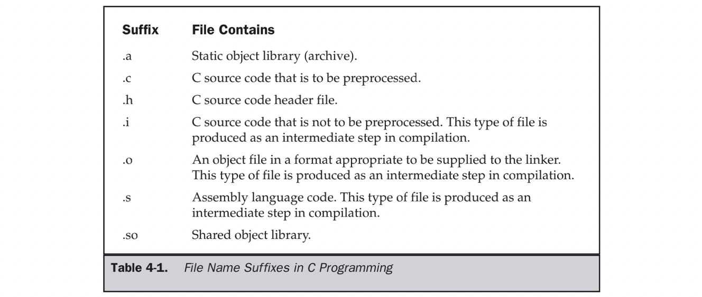

# GCC编译

Make编译链接依赖GCC

## C相关后缀

  

编译和链接
--------------------

> 链接使得分离编译(separate compilation)成为可能。不必将应用组织为一个巨大的源文件，而是分解为可管理的小模块，独立的修改编译发布
>
> 1. 可以在编译时由静态编译器完成
> 2. 可以在加载时和运行时由动态链接器完成

编译过程如下：

  

一般来说，无论是C还是C++，首先要把源文件编译成中间代码文件

- Windows是 `.obj` 文件
- UNIX下是 `.o` 文件，即ObjectFile

**编译**： 把源文件编译成中间代码ObjectFile这个动作叫做编译（compile）

> 编译时，编译器需要的是语法的正确，函数与变量的声明的正确。对于后者，通常是你需要告诉编译器头文件的所在位置（头文件中应该只是声明，而定义应该放在C/C++文件中），只要所有的语法正确，编译器就可以编译出中间目标文件。一般来说，每个源文件都应该对应于一个中间目标文件（`.o` 文件或 `.obj` 文件）。
>
> 在编译时，编译器只检测程序语法和函数、变量是否被声明。如果函数未被声明，编译器会给出一个警告，但可以生成ObjectFile。 

**链接**：把大量的中间代码ObjectFile文件合成执行文件这个动作叫作链接（link）。

> 链接时，主要是链接函数和全局变量。所以，我们可以使用这些中间目标文件（`.o` 文件或 `.obj`文件）来链接我们的应用程序。链接器并不管函数所在的源文件，只管函数的中间目标文件ObjectFile，在大多数时候，由于源文件太多，编译生成的中间目标文件太多，而在链接时需要明显地指出中间目标文件名，这对于编译很不方便。所以，我们要给中间目标文件打个包，在Windows下这种包叫"库文件"（Library File），也就是 `.lib` 文件，在UNIX下，是Archive File，也就是 `.a` 文件。
>
> 在链接时，链接器会在所有的Object File中找寻函数的实现，如果找不到，那到就会报链接错误码（Linker Error）。

总结一下，源文件首先会生成中间目标文件，再由中间目标文件生成执行文件。

### 创建静态库

- 编译成`.o`文件

  ```
  gcc -c [*.c] -o [自定义文件名]
  gcc -c [*.c] [*.c] ...
  ```

  

- 编译成静态库

  ```
  ar -r [lib自定义库名.a] [*.o] [*.o] ...
  ```

  

- 链接成可执行文件

  ```
  gcc [*.c] [*.a] -o [自定义可执行文件名]
  gcc [*.c] -o [自定义可执行文件名] -l[库名] -L[库所在路径]
  ```


### 创建动态库

- 编译成`.o`文件

  ```
  gcc -c -fpic [*.c] -o [自定义文件名]
  gcc -c -fpic [*.c] [*.c] ...
  ```

  

- 编译成静态库

  ```
  gcc -shared [*.o] [*.o]... -o [lib自定义库名.a]
  ```

  

- 链接成可执行文件

  ```
  gcc [*.c] -o [自定义可执行文件名] -l[库名] -L[库所在路径] -Wl,-rpath=[库所在路径]
  ```


## 编译过程命令

- 预处理： 

  ```
  gcc -E [.c源文件] -o [自定义输出文件名.i]
  ```

  实例如下：

  ```
  # 不会生成 .i 文件
  gcc -E main.c
  gcc -E main.c -o helloworld.i
  ```

  - -E 选项告诉编译器只进行预处理操作
  - -o 选项把预处理的结果输出到指定文件 

  

- 编译成汇编语言(隐藏了预处理操作) :

  ```
  gcc -S [.c源文件] 
  ```

  实例如下：

  ```
  gcc -S main.c
  gcc -S main.c -o xxx.s
  ```

  -S 选项告诉编译器，进行预处理和编译成汇编语言操作

  

- 会变成.o的object文件（二进制文件，可用于链接） :

  ```
  gcc -c [.c源文件] [.c源文件] [...] (可选选项：-o [自定文件名])
  ```


## 2 编译选项

>编译选项

- `-m64`: 指定编译为 64 位应用程序
- `-std=`: 指定编译标准，例如：-std=c++11、-std=c++14
- `-g`: 包含调试信息
- `-w`: 不显示警告
- `-O`: 优化等级，通常使用：-O3
- `-I`: 加在头文件路径前
- `fPIC`: (Position-Independent Code), 产生的没有绝对地址，全部使用相对地址，代码可以被加载到内存的任意位置，且可以正确的执行。这正是共享库所要求的，共享库被加载时，在内存的位置不是固定的


>链接选项

- `-l`: 加在库名前面
- `-L`: 加在库路径前面
- `-Wl,<选项>`: 将逗号分隔的 <选项> 传递给链接器
- `-rpath=`: "运行" 的时候，去找的目录。运行的时候，要找 .so 文件，会从这个选项里指定的地方去找


&emsp;

## 3 Implicit Rules

- `CC`: Program for compiling C programs; default cc
- `CXX`: Program for compiling C++ programs; default g++
- `CFLAGS`: Extra flags to give to the C compiler
- `CXXFLAGS`: Extra flags to give to the C++ compiler
- `CPPFLAGS:` Extra flags to give to the C preprocessor
- `LDFLAGS`: Extra flags to give to compilers when they are supposed to invoke the linker

